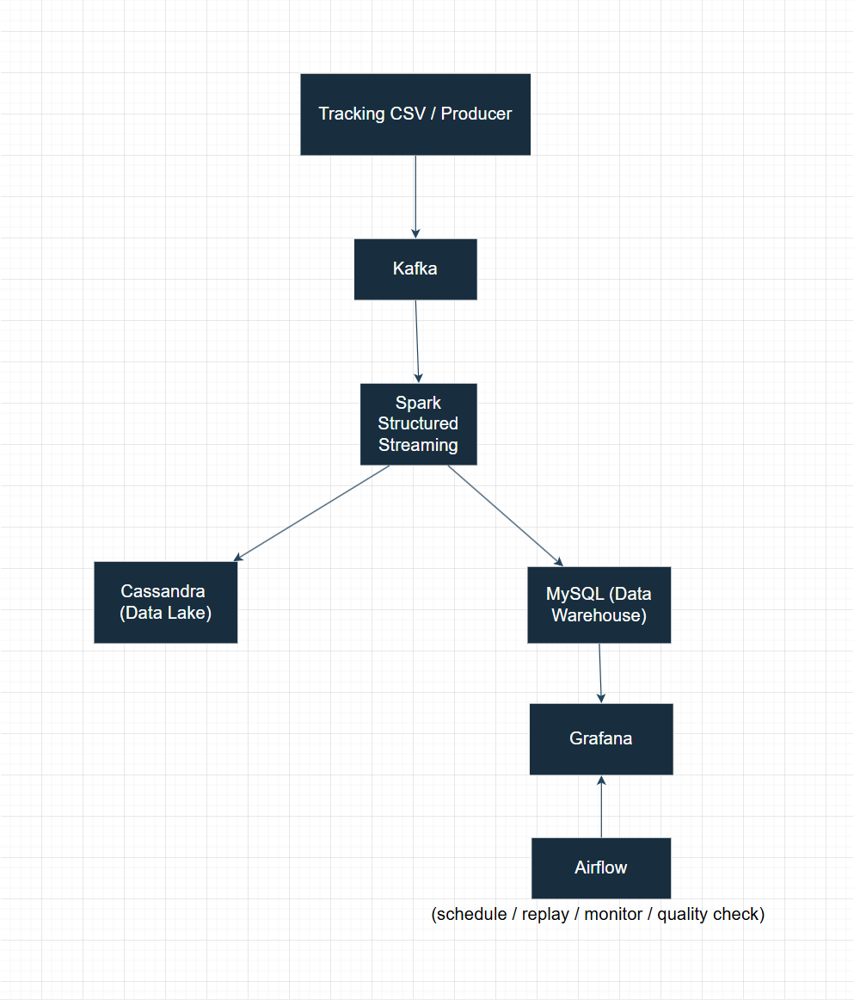
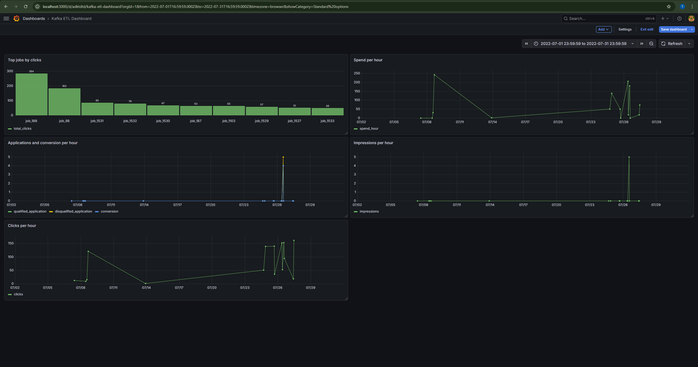
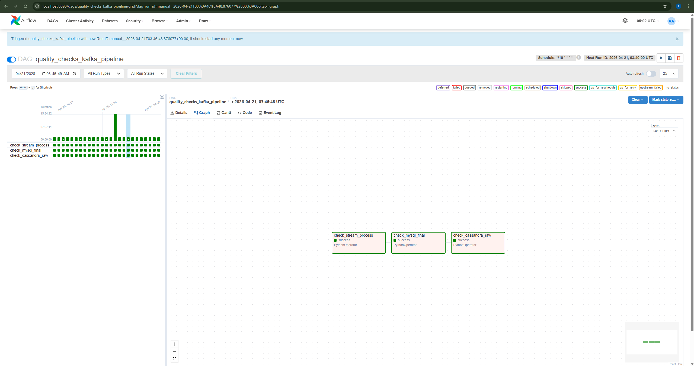
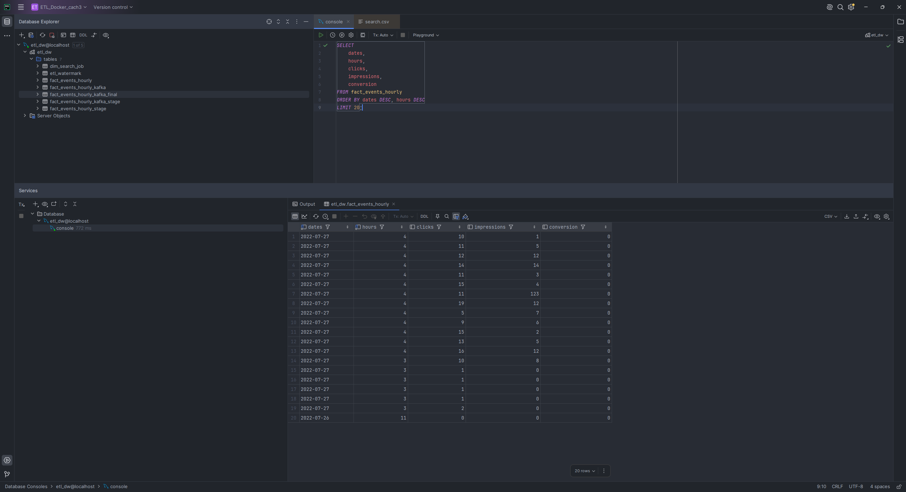

# Realtime Recruitment ETL Pipeline

A near real-time end-to-end ETL pipeline for recruitment analytics using **Kafka, Spark Structured Streaming, Cassandra, MySQL, Airflow, Grafana, and Docker**.

---

## Overview

This project simulates and processes recruitment tracking events in near real time.

The pipeline ingests event data into **Kafka**, processes the stream with **Spark Structured Streaming**, stores raw events in **Cassandra** as the Data Lake layer, writes hourly aggregated fact tables into **MySQL** as the Data Warehouse layer, visualizes business metrics in **Grafana**, and uses **Airflow** for scheduling, automation, monitoring, and quality checks.

This project was built as a portfolio-ready Data Engineering project to demonstrate practical experience with:

- event streaming
- micro-batch processing
- ETL pipeline design
- raw vs curated storage layers
- workflow orchestration
- dashboarding and monitoring
- Docker-based local environment setup

---

## Architecture

### High-level flow

1. Tracking events are replayed or produced into Kafka topic `tracking-events`
2. Spark Structured Streaming consumes Kafka events in micro-batches
3. Raw events are written into Cassandra table `logs.tracking_raw_kafka`
4. Hourly aggregates are written into MySQL stage/final fact tables
5. Grafana reads the final MySQL fact table for dashboard visualization
6. Airflow schedules replay jobs, monitors stream health, and runs quality checks

---

## Tech Stack

- **Kafka** – event ingestion / message queue
- **PySpark / Spark Structured Streaming** – stream processing and hourly aggregation
- **Cassandra** – raw event storage (Data Lake)
- **MySQL** – curated serving layer / fact table storage (Data Warehouse)
- **Airflow** – scheduling, replay automation, stream monitoring, and quality checks
- **Grafana** – dashboard and analytics visualization
- **Docker** – local containerized infrastructure
- **WSL2 + VSCode** – development environment

---

## Key Features

- Built a **near real-time ETL pipeline** using Kafka + Spark Structured Streaming
- Stored **raw events in Cassandra** for replayability and traceability
- Built **hourly aggregated fact tables in MySQL**
- Added **upsert logic** to reduce duplicate aggregated records
- Built **Grafana dashboards** for:
  - clicks
  - impressions
  - conversions
  - qualified / disqualified applications
  - spend
  - top jobs
- Integrated **Airflow DAGs** for:
  - replay automation
  - stream guard / restart logic
  - quality checks

---

## Data Flow

### Input layer
- Source file: `tracking.csv`
- Lookup file: `search.csv`
- Replay script: `replay_tracking_to_kafka.py`

### Streaming layer
- Kafka topic: `tracking-events`

### Processing layer
- Main Spark streaming job:
  - `jobs/kafka_to_cassandra_mysql_stream_upsert.py`

### Storage layer
- Cassandra raw table:
  - `logs.tracking_raw_kafka`
- MySQL final table:
  - `etl_dw.fact_events_hourly_kafka_final`

### Orchestration layer
- Airflow DAGs:
  - `hello_airflow.py`
  - `stream_guard_kafka_spark.py`
  - `replay_tracking_csv_to_kafka.py`
  - `quality_checks_kafka_pipeline.py`

### Visualization layer
- Grafana dashboard for pipeline metrics

---

## Screenshots

### Grafana Dashboard

### Airflow DAGs

### Final MySQL Fact Table

---

## Project Structure

text
ETL_DOCKER_CACH3/
├─ airflow/
│  └─ dags/
│     ├─ hello_airflow.py
│     ├─ stream_guard_kafka_spark.py
│     ├─ replay_tracking_csv_to_kafka.py
│     └─ quality_checks_kafka_pipeline.py
├─ data/
│  ├─ cassandra/
│  │  ├─ tracking.csv
│  │  └─ tracking_bad_rows_after_load.csv
│  └─ mysql/
│     └─ search.csv
├─ docs/
│  ├─ airflow-dags.png
│  ├─ architecture.png
│  ├─ grafana-dashboard.png
│  └─ mysql-final-table.png
├─ jobs/
│  ├─ kafka_to_cassandra_mysql_stream_upsert.py
│  ├─ replay_tracking_to_kafka.py
│  ├─ kafka_read_test.py
│  ├─ kafka_stream_to_console.py
│  ├─ kafka_parse_to_console.py
│  ├─ kafka_to_mysql_stream.py
│  ├─ kafka_to_cassandra_mysql_stream.py
│  ├─ kafka_parse_test.py
│  ├─ cdc_runner.py
│  └─ main.py
├─ scripts/
│  └─ start-spark.sh
├─ sql/
│  ├─ cassandra/
│  │  └─ init_tracking.cql
│  └─ mysql/
│     └─ init_dw.sql
├─ Dockerfile
├─ clean_tracking.py
├─ load_tracking_to_cassandra.py
├─ replay_tracking_to_kafka.py
├─ README.md
├─ LICENSE
└─ .gitignore

Main Components
1. Kafka

Kafka is used as the event streaming layer.
It decouples producers from consumers and allows Spark to process events in near real time.

2. Spark Structured Streaming

Spark consumes Kafka messages in micro-batches, parses event JSON, writes raw events to Cassandra, and writes aggregated facts to MySQL.

3. Cassandra

Cassandra stores raw tracking events as the Data Lake layer.
This enables replayability, traceability, and future reprocessing.

4. MySQL

MySQL stores the final curated fact table used by Grafana.
The final table is designed at an hourly grain and supports BI-style queries.

5. Airflow

Airflow orchestrates and automates the pipeline using DAGs for:

replaying events into Kafka
monitoring whether the stream job is still running
checking pipeline data quality
6. Grafana

Grafana reads the final MySQL table and displays business metrics through dashboards.

Important Tables
Cassandra
logs.tracking_raw_kafka
Raw event storage from Kafka stream
MySQL
etl_dw.fact_events_hourly_kafka
Initial append-based aggregate table
etl_dw.fact_events_hourly_kafka_stage
Temporary staging table for upsert workflow
etl_dw.fact_events_hourly_kafka_final
Final curated upserted hourly fact table
Airflow DAGs
hello_airflow

Basic DAG to verify Airflow setup

stream_guard_kafka_spark

Checks whether the Spark streaming job is running and restarts it if necessary

replay_tracking_csv_to_kafka

Replays tracking.csv into Kafka to simulate real-time events

quality_checks_kafka_pipeline

Runs health checks against:

Spark streaming process
Cassandra raw table
MySQL final fact table

How to Run
1. Start infrastructure containers

Start your Docker services:
docker start cassandra
docker start mysql
docker start spark-master
docker start spark-worker
docker start grafana
docker start zookeeper
docker start broker

2. Submit the Spark streaming job
docker exec -it spark-master bash

Inside spark-master:
spark-submit \
  --master spark://spark-master:7077 \
  --packages org.apache.spark:spark-sql-kafka-0-10_2.12:3.1.3,org.apache.kafka:kafka-clients:3.3.1 \
  /opt/project/jobs/kafka_to_cassandra_mysql_stream_upsert.py

3. Replay tracking data into Kafka
Option A: run Python script manually
python replay_tracking_to_kafka.py

Option B: trigger the Airflow DAG:

replay_tracking_csv_to_kafka

4. Verify raw data in Cassandra
SELECT COUNT(*) FROM logs.tracking_raw_kafka;
SELECT * FROM logs.tracking_raw_kafka LIMIT 10;

5. Verify final fact data in MySQL
SELECT *
FROM fact_events_hourly_kafka_final
ORDER BY dates DESC, hours DESC, job_id
LIMIT 20;

6. Open dashboards and orchestration UI
Grafana: http://localhost:3000
Airflow: http://localhost:8090

Example Metrics
The pipeline aggregates hourly metrics such as:
clicks
impressions
qualified_application
disqualified_application
conversion
bid_set
spend_hour

Grouping keys:
job_id
dates
hours
publisher_id
campaign_id
group_id

Why This Project Matters

This project demonstrates how a modern Data Engineering pipeline can combine:

Kafka for event ingestion
Spark Structured Streaming for near real-time transformation
Cassandra for raw event storage
MySQL for curated analytics data
Grafana for business dashboards
Airflow for orchestration and automation
Docker for local infrastructure reproducibility

It reflects a practical architecture that is highly relevant to real-world Data Engineering use cases.

Challenges and Solutions
1. Streaming job stability

Problem: Spark streaming jobs can fail or stop unexpectedly.
Solution: Added an Airflow DAG to monitor and restart the stream job automatically.

2. Duplicate aggregate records

Problem: Streaming append operations can create duplicate aggregated rows.
Solution: Added stage/final fact tables and upsert logic in MySQL.

3. Raw vs curated storage separation

Problem: Raw and analytical data have different access patterns.
Solution: Stored raw data in Cassandra and curated hourly facts in MySQL.

4. Local orchestration complexity
Problem: Multiple moving parts are hard to coordinate manually.
Solution: Used Airflow for automation and Docker for local infrastructure.
Resume Highlights
This project highlights practical experience with:
stream processing
ETL pipeline design
data lake / data warehouse separation
workflow orchestration
infrastructure automation
dashboarding and observability
Docker-based development environments

Future Improvements
Possible next steps for this project:
add event-level deduplication
add persistent checkpoint volumes
refactor test scripts into jobs/archive
use .env for configuration and secrets
add Docker Compose for one-command startup
deploy to a cloud environment
add CI/CD pipeline for automated testing

Author
Built by Thanh Tri as a portfolio project for Data Engineering roles.

If you use this project for learning or inspiration, feel free to fork it.

